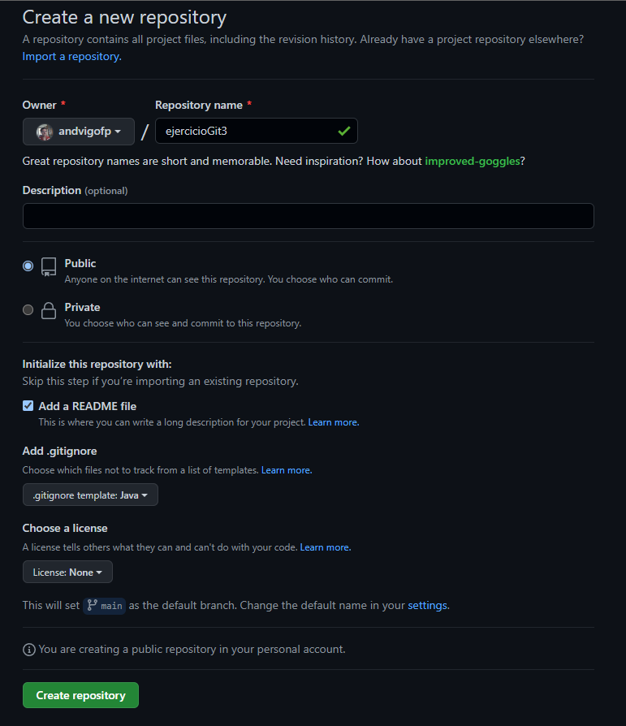
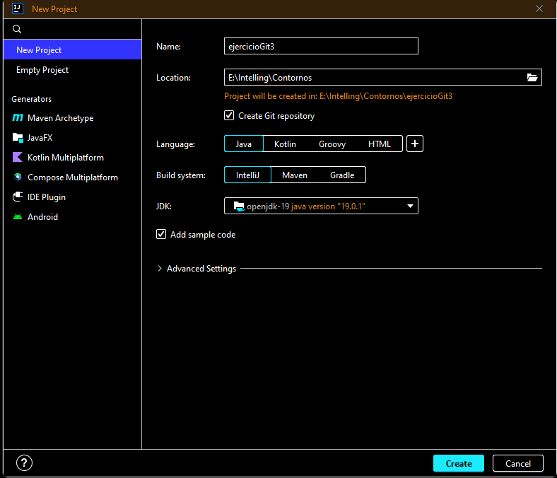
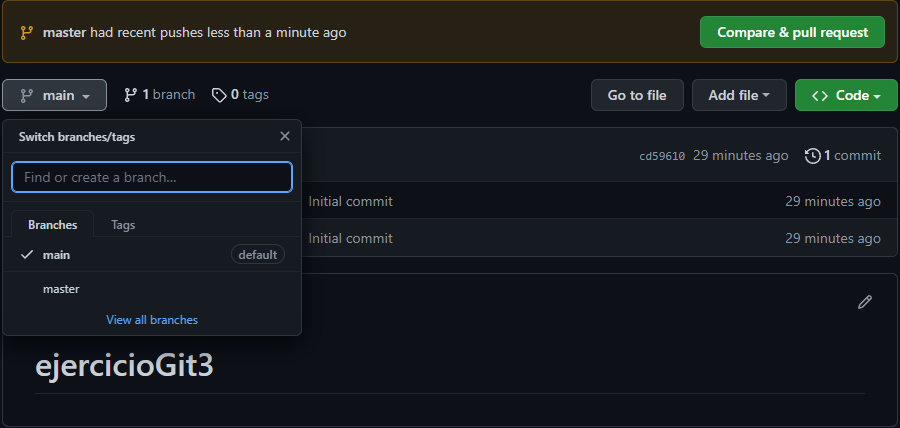
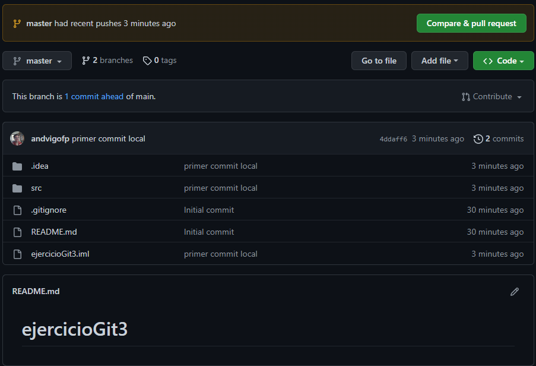

# ejercicioGit3

__Modificar las capturas y el código explicando cómo se han reproducido los pasos. Completar prestando especial atención a los TODOs.__

<!-- TODO: Id haciendo git status y git log a cada paso para tener claro lo que va
sucediendo. Podéis añadir las capturas de los resultados para un mejor seguimiento de los pasos. También se puede ver el git log dentro de IntelliJ -->

1. Creamos un repositorio nuevo en github con un README y un .gitignore



2. Creamos un proyecto nuevo marcando la opción "Create Git repository"



```bash
andri@Nfortec MINGW64 ~/e/Intelling/Contornos/ejercicioGit3 (master)
$ git status
On branch master

No commits yet

Changes to be committed:
  (use "git rm --cached <file>..." to unstage)
        new file:   .gitignore
        new file:   .idea/misc.xml
        new file:   .idea/modules.xml
        new file:   .idea/vcs.xml
        new file:   .idea/workspace.xml
        new file:   ejercicioGit3.iml
        new file:   src/Main.java
```

3. Añadimos el repo de github como remoto e intentamos hacer un pull (recordemos que lo hemos creado con un README y un .gitignore)

```bash
andri@Nfortec MINGW64 ~/e/Intelling/Contornos/ejercicioGit3 (master)
$ git remote add origin https://github.com/andvigofp/ejercicioGit3.git


andri@Nfortec MINGW64 ~/e/Intelling/Contornos/ejercicioGit3 (master)
$ git pull origin main
From https://github.com/andvigofp/ejercicioGit3.git
 * branch            main       -> FETCH_HEAD
error: Your local changes to the following files would be overwritten by merge:
        .gitignore
On branch master

No commits yet

Changes to be committed:
  (use "git rm --cached <file>..." to unstage)
        new file:   .gitignore
        new file:   .idea/misc.xml
        new file:   .idea/modules.xml
        new file:   .idea/vcs.xml
        new file:   .idea/workspace.xml
        new file:   ejercicioGit3.iml
        new file:   src/Main.java
```

No podemos hacer un pull por tener cambios en stage local que no hemos commiteado (los ficheros del proyecto local). Al crear el proyecto marcando la opción "Create Git repository", se ha hecho un git init y, aparentemente, se han añadido al stage (se ha hecho un git add) pero no hemos hecho un commit.

4. Quitamos los cambios del stage (deshacemos el git add)

```bash
andri@Nfortec MINGW64 ~/e/Intelling/Contornos/ejercicioGit3 (master)
$ git rm --cached -r .
rm '.gitignore'
rm '.idea/misc.xml'
rm '.idea/modules.xml'
rm '.idea/vcs.xml'
rm '.idea/workspace.xml'
rm 'ejercicioGit3.iml'
rm 'src/Main.java'

andri@Nfortec MINGW64 ~/e/Intelling/Contornos/ejercicioGit3 (master)
$ git status
On branch master

No commits yet

Untracked files:
  (use "git add <file>..." to include in what will be committed)
        .gitignore
        .idea/
        ejercicioGit3.iml
        src/

nothing added to commit but untracked files present (use "git add" to track)
```

5. Ahora los cambios están sin trackear. Intentamos de nuevo hacer un pull.

```bash
andri@Nfortec MINGW64 ~/e/Intelling/Contornos/ejercicioGit3 (master)
$ git pull origin main
From https://github.com/andvigofp/ejercicioGit3.git
 * branch            main       -> FETCH_HEAD
error: The following untracked working tree files would be overwritten by merge:
        .gitignore
Please move or remove them before you merge.
Aborting
```

Al haber creado un .gitignore en remoto y otro en local, hay un conflicto entre estos ficheros.

6. Podemos eliminar el .gitignore local si queremos quedarnos con el remoto:

```bash
andri@Nfortec MINGW64 ~/e/Intelling/Contornos/ejercicioGit3 (master)
$ rm .gitignore 

andri@Nfortec MINGW64 ~/e/Intelling/Contornos/ejercicioGit3 (master)
$ git pull origin main
From https://github.com/andvigofp/ejercicioGit3.git
 * branch            main       -> FETCH_HEAD
```

7. Ya tenemos descargado lo que estaba en remoto (el README y el .gitignore de GitHub) en la rama main (rama por defecto en GitHub) a nuestra rama master local.

Ahora commiteamos el proyecto local y lo subimos al repositorio.

```bash
andri@Nfortec MINGW64 ~/e/Intelling/Contornos/ejercicioGit3 (master)
$ git add .

andri@Nfortec MINGW64 ~/e/Intelling/Contornos/ejercicioGit3 (master)
$ git commit -m "primer commit local"
[master b9807b4] primer commit local
 6 files changed, 80 insertions(+)
 create mode 100644 .idea/misc.xml
 create mode 100644 .idea/modules.xml
 create mode 100644 .idea/vcs.xml
 create mode 100644 .idea/workspace.xml
 create mode 100644 ejercicioGit3.iml
 create mode 100644 src/Main.java

andri@Nfortec MINGW64 ~/e/Intelling/Contornos/ejercicioGit3 (master)
$ git log --oneline 
b9807b4 (HEAD -> master) primer commit local
20369e2 (origin/main) Initial commit

andri@Nfortec MINGW64 ~/e/Intelling/Contornos/ejercicioGit3 (master)
$ git push -u origin master
info: please complete authentication in your browser...
Enumerating objects: 11, done.
Counting objects: 100% (11/11), done.
Delta compression using up to 8 threads
Compressing objects: 100% (9/9), done.
Writing objects: 100% (10/10), 2.15 KiB | 1.08 MiB/s, done.
Total 10 (delta 0), reused 0 (delta 0), pack-reused 0
remote: 
remote: Create a pull request for 'master' on GitHub by visiting:
remote:      https://github.com/andvigofp/ejercicioGit3.git
remote:
To https://github.com/andvigofp/ejercicioGit3.git
 * [new branch]      master -> master
branch 'master' set up to track 'origin/master'.

avida@DESKTOP-EG6VTFK MINGW64 ~/TRABAJO/cd/ejercicioGit3 (master)
$ git log --oneline 
b9807b4 (HEAD -> master, origin/master) primer commit local
20369e2 (origin/main) Initial commit

```

Observamos que se ha subido correctamente pero en la rama master (que era en la que estábamos trabajando en local), mientras que la rama main se mantiene con su primer commit.




8. Eliminamos la rama main en el repositorio de GitHub

<!-- TODO: añadir capturas -->

9. Modificamos el proyecto local (commit: "añadiendo código para probar las propiedades de Java")

<!-- TODO: detallar proceso -->

Si en algún momento se nos olvida algo en un commit, podemos enmendarlo con

```bash
git commit --ammend
```

que nos pediría editar el mensaje del commit, o con

```bash
git commit --ammend --no-edit
```

que dejaría el mismo mensaje (aunque cambia el hash ya que el contenido y la hora del commit ha cambiado, es un commit distinto que el que teníamos.)

10. Creamos una nueva rama para corregir un bug:  
    __[INTENTAD ARREGLARLO POR VOSOTROS MISMOS]__:  
    Las especificaciones de nuestro programa nos impiden que una persona cambie de nombre.

```
andri@Nfortec MINGW64 ~/e/Intelling/Contornos/ejercicioGit3 (master)
$ git checkout -b fixBug1  
Switched to a new branch 'fixBug1'

andri@Nfortec MINGW64 ~/e/Intelling/Contornos/ejercicioGit3 (fixBug1)
$
```

git checkout sirve para cambiar de commit (en este caso de rama, una rama es un identificador que apunta a un determinado commit --que es el último de su rama--'). La opción -b crea una rama nueva (no podríamos hacer checkout a una rama que no existe).

También se podría hacer en dos pasos con:

```bash
git branch fixBug1 ## Crea la rama
git checkout fixBug1 ## Salta a ella
```

11. Corregimos este problem, commiteamos la corrección en la rama y la pusheamos.

```bash
andri@Nfortec MINGW64 ~/e/Intelling/Contornos/ejercicioGit3 (fixBug1)
$ git add .

andri@Nfortec MINGW64 ~/e/Intelling/Contornos/ejercicioGit3 (fixBug1)
$ git commit -m "bug corregido y testeado"

andri@Nfortec MINGW64 ~/e/Intelling/Contornos/ejercicioGit3 (fixBug1)
$ git push -u origin fixBug1
```

12. Mergeamos a master la rama con el bug ya solucionado

```
andri@Nfortec MINGW64 ~/e/Intelling/Contornos/ejercicioGit3 (fixBug1)
$ git checkout master 

andri@Nfortec MINGW64 ~/e/Intelling/Contornos/ejercicioGit3 (master)
$ git merge fixBug1 
Updating 858e9c9..a31ffce
Fast-forward
 .idea/workspace.xml | 23 +++++++++++++++++------
 src/Empleado.java   |  2 +-
 src/Main.java       |  4 +++-
 3 files changed, 21 insertions(+), 8 deletions(-)
```

13. Añado este README y la carpeta de imágenes.